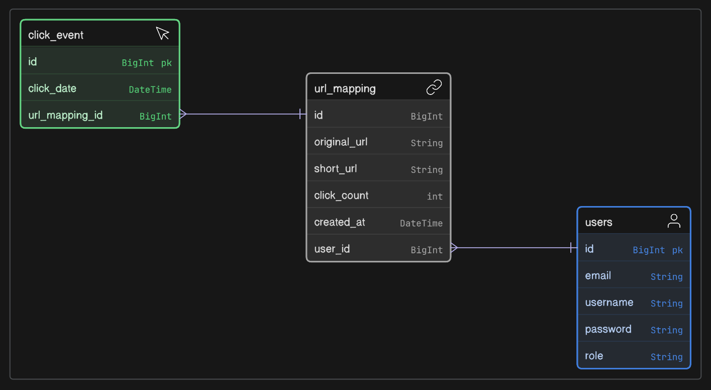
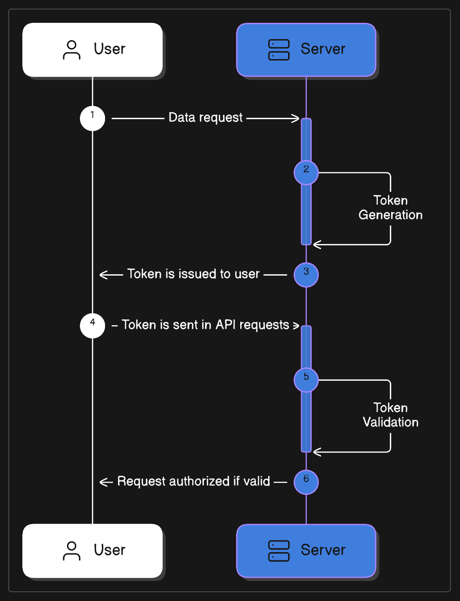

# Trimify

A lightweight web-based application that provide high performance URL shortening service. It allows users to convert long, cumbersome URLs into short, shareable links with built-in redirection logic. The service is designed with scalability, security, and analytics in mind, making it suitable for both personal and enterprise use.

## Objectives of Trimify

- Provide a fast and reliable way to shorten long URLs.
- Ensure unique and collision-free short links through proper encoding or ID generation techniques.
- Handle redirection from short URLs to original destinations seamlessly.
- Log essential click metrics for future analytics (e.g., hit count, timestamp, referrer).
- Offer a RESTful API interface to integrate with web, mobile, or browser-based clients.
- Provide a simple web UI for users to manage or track their shortened links.

---

## URL Trimify – ER Diagram



- `users` → Stores user credentials and roles.
- `url_mapping` → Contains mappings between original and shortened URLs.
  - **Many-to-One** with `users` (A user can generate many shortened URLs)
- `click_event` → Logs each time a shortened URL is accessed.
  - **Many-to-One** with `url_mapping` (Each URL can have multiple click events)

---

## Authentication using JWT (Json Web Token)



- Tokens are sent using HTTP Authorized header.

> **Format** → `Authorization: Bearer <token>`

In its compact form, JSON Web Tokens consist of three parts separated by dots (.), which are:

- Header
- Payload
- Signature

Therefore, a JWT typically looks like the: `xxxxx.yyyyy.zzzzz`

### JWT Implementation Files

- `JwtUtils` → Contains utility methods for generating, parsing, and validating JWTs. Inclues:
  - Generating a token from username
  - Validating a JWT
  - Extracting the username from a token

- `JwtAutheticationFilter` → Filters incoming requests to **check for a valid JWT in the header**, setting the authentication context if the token is valid.
  - Intercepts HTTP requests.
  - Extracts JWT from request header, validates it.
  - Configures the Spring Security context with user details if the token is valid.

- `JwtAutheticationResponse` → DTO for JWT authentication respose.

- `SecurityConfig` → Configures Spring Security files & rules for the application. Sets up the secuirty filter chain, permitting or denying the access based on paths and roles.

### Understand `UserDetailsServiceImpl`

> Spring Security has its own **inbuilt implemenation** of User which would work, but in most of the cases custom implementation is needed.

#### `UserDetailsImpl` — The User Identity Model

- This is a *custom implementation* of Spring Security's `UserDetails` interface, which represents the authenticated user's information.
- Provides a Spring Security-compatible representation of the user for authentication and authorization.

#### `UserDetailsServiceImpl` — The User Lookup Logic

- This is a *custom implementation* of `UserDetailsService`, which is a service interface provided by Spring Security.
- Spring calls this class to **fetch user data from your database** based on the username.
- Bridges the gap between the database (User entity) and Spring Security (User Details interface).

### Maven dependencies for JWT

Refer to the [Official GitHub](https://github.com/jwtk/jjwt) for [Maven dependencies for JWT](https://github.com/jwtk/jjwt?tab=readme-ov-file#maven). Add them to `pom.xml` file.

```xml
<dependency>
    <groupId>io.jsonwebtoken</groupId>
    <artifactId>jjwt-api</artifactId>
    <version>0.12.6</version>
</dependency>
<dependency>
    <groupId>io.jsonwebtoken</groupId>
    <artifactId>jjwt-impl</artifactId>
    <version>0.12.6</version>
    <scope>runtime</scope>
</dependency>
<dependency>
    <groupId>io.jsonwebtoken</groupId>
    <artifactId>jjwt-jackson</artifactId>
    <version>0.12.6</version>
    <scope>runtime</scope>
</dependency>
```

---

## Custom Security Configuration

Defines the security rules for handling HTTP requests.

### Configure `JwtAuthenticationFilter` in filter chain

- Spring Security recongnizes it as a filter that will only be executed *once per request*.
- By default, Spring Security doesn't automatically include your custom filter (`JwtAuthenticationFilter`) in the filter chain unless you explicitly add it.

### Configure `DaoAuthenticationProvider`

- It's a pre-built class in Spring Security.
- Sets up how authentication is handled by Spring Security.
- `DaoAuthenticationProvider` is an implementation of `AuthenticationProvider` that **validates user credentials** during login. It uses:
  - A `UserDetailsService` to load user details (typically from a database)
  - A `PasswordEncoder` to check credentials (e.g., hashed password verification)

### Bean for `PasswordEncoder`

```java
@Bean
public PasswordEncoder passwordEncoder() {
  return new BCryptPasswordEncoder();
}
```

- Creates a **singleton bean** of `PasswordEncoder` using `BCrypt`.
- `BCryptPasswordEncoder` hashes user passwords securely.
- Used during:
  - **Registration**: To hash and store password.
  - **Login**: To compare raw password with the hashed one stored in DB.

> Passwords must never be stored or compared as plain text.

### Bean for `AuthenticationManager`

```java
@Bean
public AuthenticationManager authenticationManager(AuthenticationConfiguration config) throws Exception {
    return config.getAuthenticationManager();
}
```

- This *integrates* cleanly with your existing `DaoAuthenticationProvider`.
- Spring uses the `AuthenticationManager` built from our custom security config (which includes our custom `DaoAuthenticationProvider`).

---

## Build Authentication – Login

### 1. Receive User Login Input

```java
public JwtAuthenticationResponse authenticate(LoginRequest loginRequest)
```

This method starts by accepting a `LoginRequest` object containing the user's username and password.

### 2. Perform Authentication with `AuthenticationManager`

```java
Authentication authentication = authenticationManager.authenticate(
    new UsernamePasswordAuthenticationToken(
        loginRequest.getUsername(), loginRequest.getPassword()
    )
);
```

1. Creates a `UsernamePasswordAuthenticationToken` using the credentials provided by the user.

2. Passes it to the authenticationManager to authenticate the user:
    - Behind the scenes, Spring uses your configured `DaoAuthenticationProvider`.
    - It will call `UserDetailsServiceImpl.loadUserByUsername()`.
    - *Compares the provided password* (raw) with the hashed one from DB using `PasswordEncoder`.

3. If authentication is **successful**, it returns an `Authentication` object.

> If authentication **fails**, Spring throws an exception (e.g., `BadCredentialsException`).

### 3. Store Authentication in Security Context

```java
SecurityContextHolder.getContext().setAuthentication(authentication);
```

1. After successful authentication, you **store** the `Authentication` object in **Spring Security’s context**.

2. This sets the current user as "authenticated" for the rest of the request lifecycle.

3. Future authorization checks (like `@PreAuthorize`) will use this context.

### 4. Extract User Details from Principal

```java
UserDetailsImpl userDetails = (UserDetailsImpl) authentication.getPrincipal();
```

1. Retrieves the authenticated user’s details from the `Authentication` object.

2. `getPrincipal()` returns the object returned by your `UserDetailsService` — in this case, your custom `UserDetailsImpl`.

### 5. Generate JWT Token & Return in Custom Response Object

```java
String jwtToken = jwtUtils.generateJwtToken(userDetails);
return new JwtAuthenticationResponse(jwtToken);
```

1. Calls a utility method (`JwtUtils`) to generate a JWT token.
2. Returns the token wrapped in a response DTO.

---

## Auth Request Validation

### Dependency Required

```xml
<dependency>
    <groupId>org.springframework.boot</groupId>
    <artifactId>spring-boot-starter-validation</artifactId>
</dependency>
```

### Important Validation Annotations

Annotate DTO fields with the following annotations:

- `@NotBlank` → Ensures field is not null, empty, or whitespace (applicable ONLY for **String**)
- `@Email` → Validates structure of an email address
- `@Size(min=8)` → Ensures the field is at least 8 characters long
- `@NotEmpty` → Checks for not null and not empty (`size() > 0` or `length > 0`) (applicable for Strings, Collections, Maps, Arrays). It doesn't check for whitespace

### `@Valid` Annotation in Controller

- Spring only **triggers validation on DTO fields** when the request body is *annotated with `@Valid`*.
- Use `@Valid` in **controller method parameters**.

> Without `@Valid`, validation annotations are ignored, and invalid data may reach the business logic.

### Why `GlobalExceptionHandler` is Needed?

- When *validation fails*, Spring throws a `MethodArgumentNotValidException`. To return clean, structured error responses, you must **handle this exception globally**.
- Implement `@RestControllerAdvice` to handle exceptions globally.

**Benefits**:

- Returns field-specific error messages in JSON format
- Keeps controller code clean and focused
- Provides centralized error handling

---

### Author

- [Soumo Sarkar](https://www.linkedin.com/in/soumo-sarkar/)
